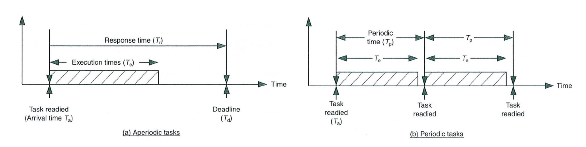

# Exploring the Different Priority-Based Scheduling Policies for RTOS

Arrival Time, Ta: the time at which a task is put into the ready-to-run state 
- A moment in time not a length of time 

Deadline, Td: the time by which the task must deliver its result
- A moment in time not a length of time 

Response Time, Tr: the time allowed for a task to carry out its function
- A length of time 

Periodic Time, Tp: the time between successive invocations of a periodic task
- A length of time 
- Not necessarily the same as response time but response time is bounded by the periodic time

Execution Time, Te: the actual time spent executing its function
- A length of time 

## Non-Pre-Emptive Scheduling Policies
### Shortest Job First (SJF)
- No pre-emption
- Priority only dictates the position of the task in the ready queue
- Priority is decided by:
$$P = \frac{1}{T_e}$$
- The shortest execution time will have the highest priority
- Generally produces a better ***average*** response time
- Long tasks can get starved out so for best performance of this policy all tasks execution times should be short and close in length

### Highest Response Ratio Next (HRRN)
- Improvement on SJF to prevent starving longer tasks
- This scheme considers wait time in the ready queue and increases priority based on time waited, Tw
- A possible priority scheme could be as follows:
$$P = \frac{1}{T_e} + \frac{T_w}{T_e}$$
- The first term $\frac{1}{T_e}$ determines the initial priority of the tasks ("static")
- The second term $\frac{T_w}{T_e}$ increases the priority "dynamically" as wait time increases, this term still considers execution time and therefore still favours shorter tasks
- This equations is normalized for conciseness but each term will have constants which can be tuned for performance
- Unlikely to be used in fast real-time systems

### Co-operative Scheduling
- Context switches are determined by the current running task
- A task may
    - Designate the next task to be run
    - Return control to the scheduler
    - Return control + information to the scheduler
- System behaviour is much more predictable, especially if tasks are periodic
- Suitable for use in critical systems

## Pre-Emptive Scheduling Policies
In static scheduling policies the programmer decides the priority/criteria at compile time.
There are 4 criteria for deciding priority settings:
- Response time, Tr
- Computation times, Te
- Periodic execution times (periodicity), Tp
- Experience/judgement

There are 3 policies which prioritize each of the first three criteria above
- Shortest Response Time (SRT)
- Shortest Job First (SJF) - This is a pre-emptive version of the previously decribed SJF
- Rate Monotonic Scheduling (RMS) - Based on periodicity

### A Comparison of SRT, SJF, and RMS

| Task | Type      | Response Time     | Computational Time | Period |
|------|-----------|-------------------|--------------------|--------|
| 1    | Periodic  | 20 ms             | 10 ms              | 100 ms |
| 2    | Periodic  | 18 ms             | 15 ms              | 120 ms |
| 3    | Aperiodic | 110 ms - Deadline |  5 ms              | -      |
| 4    | Aperiodic | 5 ms - Deadline   |  2 ms              | -      |

| Scheduling Policy | SRT | SJF | RMS |
|-|-|-|-|
| | 4 - Highest | 4 - Highest | 1 - Highest |
| | 2 | 3 | 2 |
| | 1 | 1 | ? |
| | 3 | 2 | ? |

Since Task 4 has the shortest response time and execution time, it is the highest priority task for both the SRT and SJF policies. Since task 1 has the shortest period it is the highest priority in a RMS policy. The priorities of the aperiodic tasks are unknown as RMS assumes all tasks to be periodic.

### Shortest Response Time (SRT)
- The shortest task is given the highest priority, as seen by the following equation:
$$P = \frac{1}{T_r}$$
- Required response times can be subjective

### Shortest Job First (SJF)
- Same as the previous shortest job first scheme but tasks can be pre-empted
- Priority is determined in the same fashion as before:
$$P = \frac{1}{T_e}$$
- Sometimes execution time is hard to determine, especially in the early stages of a project

### Rate Monotonic Scheduling (RMS)
- Frequently claimed that RMS offers superior performance
- Sets priority based on shortest period as so:
$$P = \frac{1}{T_p}$$
- RMS theory makes several assumptions about the tasks:
    - All tasks are periodic
    - A task's deadline is the same as its period (Tr == Tp)
    - Tasks may be pre-empted
    - All tasks are equally important (even though they have different priority)
    - No tasks have critical sections
    - Tasks are independant of each other
    - The worst-case execution time of a task is a constant
- Feasibility must be checked while considering an RMS policy
- Utilization of an individual task is $U = \frac{T_e}{T_p}$
- The total Utilization is $U_t = \sum_{i=1}^{n}\frac{T_{ei}}{T_{pi}}$
- Full Utilization in an RMS policy is not a CPU with a load of 1 but when the task schedule is feasible but ***any*** increase in execution times will lead to failure
- To calculate the Full Utilization of a CPU using an RMS policy use the following equation:
$$U_{full} =n(2^{1/n} - 1) \text{, where n is the number of tasks}$$
- The total utilization must be less than the full utilization for the scheme to be feasible, $U_t < U_{full}$
- Some of the downsides of an RMS policy are:
    - Cannot deal with aperiodic tasks
    - Task deadline and period are the same
    - Tasks are independant

#### Aperiodic Tasks in RMS
Two methods to handle aperiodic tasks:
- Make them periodic through polling techniques
- Provide computing resources to deal with the random arrival of an aperiodic task *within a pre-defined period* (aperiodic server)

Revisiting the previous example, we can make both aperiodic tasks periodic

| Task | Type      | Response Time     | Computational Time | Period |
|------|-----------|-------------------|--------------------|--------|
| 1    | Periodic  | 20 ms             | 10 ms              | 100 ms |
| 2    | Periodic  | 18 ms             | 15 ms              | 120 ms |
| 3    | 'Periodic' | 110 ms  |  5 ms              | 150 ms      |
| 4    | 'Periodic' | 5 ms    |  2 ms              | 250 ms      |

Assuming that in the worst case scenario task 3 may be re-readied every 150 ms and task 4 every 250 ms.

The priorities with this setup are as follows:
|Task|Period|Priority|
|-|-|-|
|1|100 ms|1|
|2|120 ms|2|
|3|150 ms|3|
|4|250 ms|4|

However, if we look at the execution times of these tasks we see that:
- At (t0 + 30 ms) tasks 1, 2, and 3 are complete - periodic tasks just need to finish within their period but aperiodic tasks have dealines to meet
- At (t0 + 32 ms) task 4's deadline was missed meaning this scheme is not feasible

This can be fixed by considering another way to choose the period of aperiodic tasks.

We can set the period of the aperiodic tasks by their response time:

| Task | Type      | Response Time     | Computational Time | Period |
|------|-----------|-------------------|--------------------|--------|
| 1    | Periodic  | 20 ms             | 10 ms              | 100 ms |
| 2    | Periodic  | 18 ms             | 15 ms              | 120 ms |
| 3    | 'Periodic' | 110 ms  |  5 ms              | 110 ms      |
| 4    | 'Periodic' | 5 ms    |  2 ms              | 5 ms      |

The priorities with this setup are as follows:
|Task|Period|Priority|
|-|-|-|
|1|100 ms|2|
|2|120 ms|4|
|3|110 ms|3|
|4|5 ms|1|

This schedule now works but now has to run task 4 every 5 ms which greatly increases processor utilization.

A way to overcome this is *deadline monotonic* scheduling, which determines the priority based on the shortest deadline. The deadline is the period for periodic tasks.

| Task | Type      | Response Time     | Computational Time | Period |
|------|-----------|-------------------|--------------------|--------|
| 1    | Periodic  | 20 ms             | 10 ms              | 100 ms |
| 2    | Periodic  | 18 ms             | 15 ms              | 120 ms |
| 3    | 'Periodic' | 110 ms  |  5 ms              | 150 ms      |
| 4    | 'Periodic' | 5 ms    |  2 ms              | 250 ms      |

The period of task 4 stays 250 ms but since priority is based on deadline, when it is ready it pre-empts the other tasks, executing until completion.

|Task|Period|Priority|
|-|-|-|
|1|100 ms|2|
|2|120 ms|4|
|3|150 ms|3|
|4|250 ms|1|

## Priority Based Pre-Emptive **Dynamic** Scheduling Policies

The main objective of dynamic scheduling policies is to maximize performance by making run-time descisions base on the actual (current) system state.

- Priorities are assigned:
    - In accordance with criteria based on time factors
    - On the fly, as tasks are executed

Most dynamic scheduling policies take into account the following information
- Task execution time, Te
- Required response time, Tr
- Spare time, Ts
- Required completion time (deadline), Td
- Task arrival time, Ta